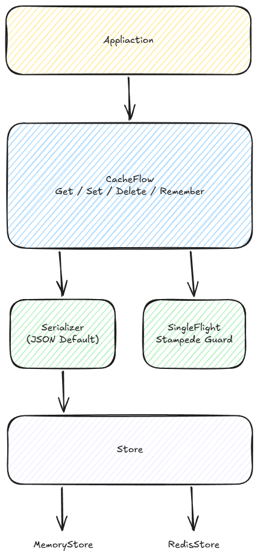

# CacheFlow

[](https://github.com/elokanugrah/go-cacheflow/actions/workflows/ci.yml)
[](https://goreportcard.com/report/github.com/elokanugrah/go-cacheflow)
[](https://pkg.go.dev/github.com/elokanugrah/go-cacheflow)
[](LICENSE)

Go-CacheFlow is a cache-aside orchestration library for Go that simplifies cache retrieval, population, and stampede prevention through a single `Remember()` API.

Instead of repeatedly writing cache lookup, cache miss handling, database loading, cache population, and stampede prevention logic, CacheFlow provides a unified abstraction focused on one thing:

> **Retrieve from cache if available, otherwise load once, cache it, and return it safely.**

---

## Why CacheFlow?

Cache-aside is one of the most common caching patterns in backend systems.

Unfortunately, the implementation is often repetitive and error-prone.

Without CacheFlow:

```go
userJSON, err := redis.Get(ctx, key)

if err == redis.Nil {
    user, err := repo.GetByID(ctx, id)
    if err != nil {
        return User{}, err
    }

    payload, _ := json.Marshal(user)

    redis.Set(ctx, key, payload, time.Minute)

    return user, nil
}

var user User
json.Unmarshal([]byte(userJSON), &user)

return user, nil
```

Now imagine maintaining this pattern across dozens of services and hundreds of endpoints.

With CacheFlow:

```go
user, err := cacheflow.Remember(
    ctx,
    cache,
    "user:123",
    time.Minute,
    func(ctx context.Context) (User, error) {
        return repo.GetByID(ctx, 123)
    },
)
```

That's it.

CacheFlow handles:

- Cache lookup
- Cache miss detection
- Serialization
- Cache population
- SingleFlight deduplication
- Stampede prevention

---

## Features

### Cache-Aside Orchestration

Simplify cache lookup and population into a single operation.

### Built-in Stampede Protection

Concurrent requests for the same missing key are automatically deduplicated using SingleFlight.

### Generic Type-Safe API

Use native Go generics without manual serialization boilerplate.

### Typed Wrapper API

Cleaner developer experience for repeated operations on the same type.

### Multiple Store Backends

- Memory Store
- Redis Store

### Pluggable Serialization Layer

Serializer abstraction allows future extensions beyond JSON.

### Deterministic Error Contract

Clear and predictable error behavior.

### Production Ready

- Race-tested
- 100% test coverage
- CI validated
- ADR documented

---

## Installation

```bash
go get github.com/elokanugrah/go-cacheflow
```

---

## Quick Start

```go
package main

import (
	"context"
	"time"

	"github.com/elokanugrah/go-cacheflow"
)

type User struct {
	ID   int
	Name string
}

func main() {
	cache := cacheflow.New()
	ctx := context.Background()

	user, err := cacheflow.Remember(
		ctx,
		cache,
		"user:1",
		time.Minute,
		func(ctx context.Context) (User, error) {
			return User{
				ID:   1,
				Name: "Alice",
			}, nil
		},
	)

	_ = user
	_ = err
}
```

---

## How It Works

```mermaid
flowchart TD

    A[Request]
    B[cacheflow.Remember()]
    C[Cache Lookup]

    D[Cache Hit]
    E[Cache Miss]

    F[SingleFlight]
    G[Loader]
    H[Cache Set]

    I[Return Value]

    A --> B
    B --> C

    C --> D
    C --> E

    D --> I

    E --> F
    F --> G
    G --> H
    H --> I
```

### Request Lifecycle

1. CacheFlow checks the cache.
2. If the key exists, the cached value is returned.
3. If the key is missing:
   - SingleFlight ensures only one loader executes.
   - The loader retrieves the data.
   - The value is stored in cache.
   - All waiting callers receive the same result.

---

## Architecture Overview

CacheFlow acts as a cache orchestration layer between your application and cache backends.



### Core Components

#### CacheFlow

Coordinates cache retrieval, loading, storage, and concurrency control.

#### Serializer

Responsible for converting values to and from raw bytes.

Current implementation:

- JSON Serializer

#### SingleFlight

Prevents cache stampedes by ensuring only one concurrent loader execution per key.

#### Store

Abstracts cache backends behind a simple interface.

Supported implementations:

- MemoryStore
- RedisStore

---

## Stampede Protection

One of the primary goals of CacheFlow is preventing cache stampedes.

Without SingleFlight:

```text
1000 Requests
      │
      ▼
 Cache Miss
      │
      ▼
1000 Loader Calls
      │
      ▼
 Database Overload
```

With CacheFlow:

```text
1000 Requests
      │
      ▼
 Cache Miss
      │
      ▼
 SingleFlight
      │
      ▼
 1 Loader Call
      │
      ▼
1000 Responses
```

This significantly reduces backend pressure during cache misses.

---

## Real World Example

```go
type User struct {
	ID   int    `json:"id"`
	Name string `json:"name"`
}

type UserRepository interface {
	GetByID(ctx context.Context, id int) (User, error)
}

func GetUser(
	ctx context.Context,
	cache cacheflow.Cache,
	repo UserRepository,
	id int,
) (User, error) {

	key := fmt.Sprintf("user:%d", id)

	return cacheflow.Remember(
		ctx,
		cache,
		key,
		5*time.Minute,
		func(ctx context.Context) (User, error) {
			return repo.GetByID(ctx, id)
		},
	)
}
```

---

## Typed Wrapper API

For services repeatedly working with the same type, a typed wrapper can reduce verbosity.

```go
users := cacheflow.Typed[User](cache)

user, err := users.Remember(
	ctx,
	"user:123",
	time.Minute,
	func(ctx context.Context) (User, error) {
		return repo.GetByID(ctx, 123)
	},
)
```

---

## Supported Stores

### Memory Store

```go
cache := cacheflow.New()
```

Ideal for:

- Local development
- Unit tests
- Single-instance applications

---

### Redis Store

```go
client := redis.NewClient(&redis.Options{
	Addr: "localhost:6379",
})

store := redisstore.New(client)

cache := cacheflow.NewWithStore(store)
```

Ideal for:

- Distributed systems
- Horizontal scaling
- Shared cache infrastructure

---

## Running Examples

### Memory Example

```bash
go run ./example/basic
```

### Redis Example

Start Redis:

```bash
docker run -d \
  --name cacheflow-redis \
  -p 6379:6379 \
  redis
```

Run example:

```bash
go run ./example/redis
```

---

## Benchmarks

Run benchmarks locally:

```bash
go test -bench=. -benchmem ./benchmark/...
```

### Stampede Comparison

```text
1000 Concurrent Requests

Without SingleFlight:
1000 loader calls

With CacheFlow:
1 loader call
```

### Sample Results

```text
BenchmarkRemember_CacheHit
BenchmarkRemember_CacheMiss
BenchmarkRemember_SingleFlight
BenchmarkStampede_NoSingleFlight
BenchmarkStampede_WithSingleFlight
```

Benchmark numbers may vary depending on hardware.

---

## Error Handling

CacheFlow follows a deterministic error contract.

### Detecting Cache Misses

```go
value, err := cacheflow.Get[User](
	ctx,
	cache,
	"user:123",
)

if errors.Is(err, cacheflow.ErrCacheMiss) {
	// key not found
}
```

---

### Error Sources

| Source | When | Behavior |
|----------|----------|----------|
| ErrCacheMiss | Key missing or expired | Returned by Get(). Remember() invokes loader instead |
| Loader Error | Loader returns error | Propagated directly, never cached |
| Serializer Error | Marshal/Unmarshal failure | Returned directly |
| Store Error | Backend failure | Returned directly |

---

### Loader Error Behavior

```text
Cache Hit
    │
    ▼
 Return

Cache Miss
    │
    ▼
 Loader
    │
    ├── Success
    │      │
    │      ▼
    │    Cache
    │      │
    │      ▼
    │    Return
    │
    └── Error
           │
           ▼
        Return Error
```

### Error Propagation Rules

- Errors are returned directly.
- Use `errors.Is()` for sentinel errors.
- Loader errors are never cached.
- Store errors are returned immediately.
- Serializer errors are returned immediately.
- Cache write failures do not discard successfully loaded data.
- If the loader succeeds but cache persistence fails, the value is still returned to the caller.

---

## Testing

Run all tests:

```bash
go test -race -cover ./...
```

Coverage report:

```bash
go test -coverprofile=coverage.out ./...
go tool cover -func=coverage.out
```

Current project status:

- 67 Tests
- 100% Coverage
- Race Detector Clean
- CI Verified

---

## Architecture Decision Records (ADR)

Significant design decisions are documented in the `adr/` directory.

Current ADRs:

| ADR | Description |
|------|------------|
| ADR-0001 | Store operates on raw bytes |
| ADR-0002 | TTL zero means no expiration |
| ADR-0003 | Lazy expiration strategy |
| ADR-0004 | Generic API and Typed Wrapper |
| ADR-0005 | SingleFlight strategy |
| ADR-0006 | Cache interface boundary |

ADRs provide context behind architectural choices and help maintain consistency as the project evolves.

---

## Roadmap

### v0.2

- Multi-layer Cache (Memory + Redis)
- Metrics Hooks
- Cache Events
- Store Decorators

### v0.3

- Stale-While-Revalidate
- Tracing Hooks
- Advanced Cache Strategies

---

## Contributing

Contributions, issues, discussions, and pull requests are welcome.

Please read:

```text
CONTRIBUTING.md
```

before submitting changes.

---

## License

MIT License.

See [LICENSE](LICENSE) for details.